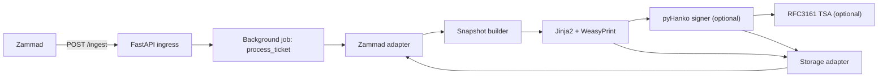

# zammad-ticket-archiver

`zammad-ticket-archiver` is a FastAPI webhook service that archives Zammad tickets as PDF files on a filesystem target (local path or mounted CIFS/SMB).

Processing pipeline:

`webhook -> fetch ticket data -> build snapshot -> render PDF -> optional sign -> optional timestamp -> store PDF + audit sidecar -> update ticket tags + note`

## What It Does

- Exposes `POST /ingest` to receive Zammad webhooks.
- Fetches ticket, tags, and articles from Zammad REST API.
- Renders a PDF with Jinja2 templates + WeasyPrint.
- Optionally applies:
  - PAdES signature (PKCS#12/PFX)
  - RFC3161 timestamp token (TSA)
- Writes two files:
  - PDF
  - audit sidecar JSON (`<filename>.json`, for PDFs usually `...pdf.json`)
- Writes an internal note to the ticket and transitions archive tags.

## How Archiving Works

### Trigger Tag

Default trigger tag is `pdf:sign` (`workflow.trigger_tag`).

Processing behavior:
- `workflow.require_tag=true` (default): ticket is processed only when trigger tag is present.
- If ticket already has `pdf:signed`, processing is skipped.

### Required Ticket Fields

Defaults are configurable for the first two fields:
- `archive_path` (`fields.archive_path`, required)
- `archive_user_mode` (`fields.archive_user_mode`, optional, default `owner`)

`archive_user_mode` values:
- `owner`: use `ticket.owner.login`
- `current_agent`: use webhook `payload.user.login`, fallback `ticket.updated_by.login`
- `fixed`: use `custom_fields.archive_user` (required in this mode)

Note:
- `archive_user` field name is currently fixed in code and not configurable.

### Tag State Transitions

- Start: `apply_processing()`
  - remove `pdf:signed`, `pdf:error`, trigger tag
  - add `pdf:processing`
- Success: `apply_done()`
  - remove `pdf:processing`, `pdf:error`, trigger tag
  - add `pdf:signed`
- Failure: `apply_error()`
  - remove `pdf:processing`, `pdf:signed`
  - add `pdf:error`
  - transient failures keep/re-add trigger tag
  - permanent failures remove trigger tag

## Architecture Overview



Detailed architecture and state diagrams:
- [`docs/01-architecture.md`](docs/01-architecture.md)

## Quickstart (Development)

Prerequisites:
- Docker with `docker compose`
- Python 3.12+ (for local lint/test)

1. Create local environment file:

```bash
cp .env.example .env
```

2. Set minimum required values in `.env`:
- `ZAMMAD_BASE_URL`
- `ZAMMAD_API_TOKEN`
- `STORAGE_ROOT`
- webhook auth:
  - recommended: `WEBHOOK_HMAC_SECRET`
  - test-only fallback: `HARDENING_WEBHOOK_ALLOW_UNSIGNED=true`

3. Start dev stack:

```bash
make dev
```

4. Run checks:

```bash
make lint
make test
```

Endpoints:
- `POST /ingest`
- `GET /healthz`
- `GET /metrics` (only when enabled)

## Configuration

Precedence (highest first):
1. Environment variables (including values loaded from `.env`)
2. Flat env aliases (backward-compat keys)
3. YAML config (`CONFIG_PATH`, or `config/config.yaml` when present)
4. Defaults in settings model

Configuration references:
- [`.env.example`](.env.example)
- [`config/config.example.yaml`](config/config.example.yaml)
- [`docs/config-reference.md`](docs/config-reference.md)

## Operational Notes

- All output paths are validated and confined under `storage.root`.
- Default storage writes are atomic (`storage.atomic_write=true`) and fsynced (`storage.fsync=true`).
- Signing requires `signing.enabled=true` and `signing.pfx_path`.
- Timestamping requires signing plus:
  - `signing.timestamp.enabled=true`
  - `signing.timestamp.rfc3161.tsa_url`
- TSA basic auth (if needed) uses env-only keys:
  - `TSA_USER`
  - `TSA_PASS`
- Delivery ID dedupe is in-memory only and resets on process restart.

Operational docs:
- [`docs/04-path-policy.md`](docs/04-path-policy.md)
- [`docs/06-signing-and-timestamp.md`](docs/06-signing-and-timestamp.md)
- [`docs/07-storage.md`](docs/07-storage.md)
- [`docs/08-operations.md`](docs/08-operations.md)
- [`docs/09-security.md`](docs/09-security.md)

## Full Documentation Index

- [`docs/PRD.md`](docs/PRD.md) – Product Requirements Document
- [`docs/00-overview.md`](docs/00-overview.md)
- [`docs/01-architecture.md`](docs/01-architecture.md)
- [`docs/02-zammad-setup.md`](docs/02-zammad-setup.md)
- [`docs/03-data-model.md`](docs/03-data-model.md)
- [`docs/04-path-policy.md`](docs/04-path-policy.md)
- [`docs/05-pdf-rendering.md`](docs/05-pdf-rendering.md)
- [`docs/06-signing-and-timestamp.md`](docs/06-signing-and-timestamp.md)
- [`docs/07-storage.md`](docs/07-storage.md)
- [`docs/08-operations.md`](docs/08-operations.md)
- [`docs/09-security.md`](docs/09-security.md)
- [`docs/api.md`](docs/api.md)
- [`docs/config-reference.md`](docs/config-reference.md)
- [`docs/faq.md`](docs/faq.md)
