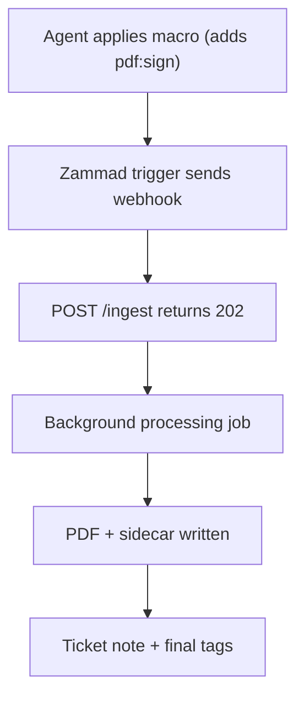

# 00 - Overview

`zammad-pdf-archiver` is a webhook-driven service that converts Zammad tickets into archived PDF files on filesystem storage (local disk or mounted CIFS/SMB).

It can optionally add:
- PAdES PDF signatures
- RFC3161 timestamps (TSA)

## Scope

This repository provides:

- FastAPI service endpoints:
  - `POST /ingest`
  - `GET /healthz`
  - `GET /metrics` (when enabled)
- End-to-end ticket processing:
  1. receive webhook
  2. fetch ticket + tags + articles from Zammad
  3. build normalized snapshot model
  4. render PDF
  5. optionally sign and timestamp
  6. write PDF + sidecar JSON to storage
  7. update ticket note + tags
- Runtime hardening controls:
  - webhook HMAC verification
  - optional delivery ID requirement
  - request size limits
  - rate limiting
  - transport safety checks for upstream URLs

## Non-goals

Out of scope by design:

- exporting attachment binary payloads by default (attachments are metadata-only in snapshot/PDF; optional `pdf.include_attachment_binary` can write binaries to disk and the sidecar)
- archive browsing/search UI
- distributed durable queue
- durable distributed idempotency store
- built-in retention/WORM policy engine
- built-in encryption-at-rest management
- multi-tenant isolation beyond path policy and external ACLs

## High-Level Behavior

## Start Here

- Architecture and module boundaries: [`01-architecture.md`](01-architecture.md)
- Zammad admin setup: [`02-zammad-setup.md`](02-zammad-setup.md)
- Path and filename policy: [`04-path-policy.md`](04-path-policy.md)
- PDF rendering and templates: [`05-pdf-rendering.md`](05-pdf-rendering.md)
- Signing and timestamping: [`06-signing-and-timestamp.md`](06-signing-and-timestamp.md)
- Storage behavior and durability: [`07-storage.md`](07-storage.md)
- Operations and troubleshooting: [`08-operations.md`](08-operations.md)
- Security model and mitigations: [`09-security.md`](09-security.md)
- API contract: [`api.md`](api.md)
- Configuration keys: [`config-reference.md`](config-reference.md)

## Glossary

- **Audit sidecar**: JSON file written next to each PDF containing checksum and processing metadata.
- **Archive path**: ticket custom field defining path segments under storage root.
- **Archive user mode**: strategy that selects the first directory component (`owner`, `current_agent`, `fixed`).
- **Delivery ID**: `X-Zammad-Delivery` header used for best-effort in-memory deduplication.
- **HMAC**: webhook signature validation via `X-Hub-Signature: sha1=<hex>` or `sha256=<hex>`.
- **PAdES**: PDF Advanced Electronic Signatures profile.
- **RFC3161**: timestamp protocol used by Time Stamping Authorities.
- **TSA**: Time Stamping Authority endpoint used for timestamp tokens.
