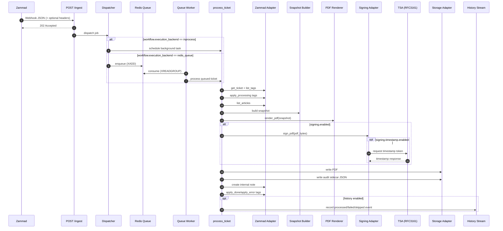
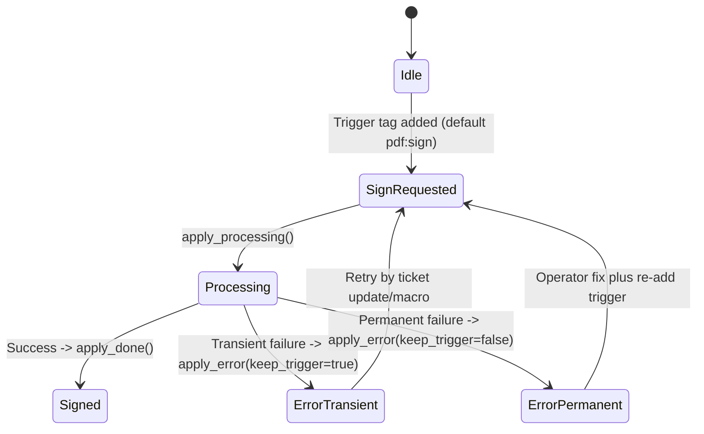

# 01 - Architecture

`zammad-pdf-archiver` is a single API service with two execution modes:
- in-process background worker (`workflow.execution_backend=inprocess`)
- Redis queue worker (`workflow.execution_backend=redis_queue`)

## Runtime Flow

## Tag State Machine

State details:
- `pdf:signed` is terminal for automatic processing (`should_process` returns false).
- `pdf:processing` is best-effort cleaned in both success and error paths.
- `pdf:error` is set on failures.

## Module Boundaries

### Ingress and app wiring

Code:
- `src/zammad_pdf_archiver/app/server.py`
- `src/zammad_pdf_archiver/app/routes/ingest.py`
- `src/zammad_pdf_archiver/app/middleware/`
- `src/zammad_pdf_archiver/app/jobs/process_ticket.py`

Responsibilities:
- expose HTTP endpoints
- enforce ingress hardening (HMAC, body size, rate limit, request ID)
- schedule asynchronous background processing

### Zammad adapter

Code:
- `src/zammad_pdf_archiver/adapters/zammad/client.py`
- `src/zammad_pdf_archiver/adapters/zammad/models.py`

Responsibilities:
- fetch ticket, tags, and articles
- create internal ticket notes
- add/remove tags

### Snapshot adapter

Code:
- `src/zammad_pdf_archiver/adapters/snapshot/build_snapshot.py`
- `src/zammad_pdf_archiver/domain/snapshot_models.py`

Responsibilities:
- normalize Zammad payloads into stable snapshot schema
- sanitize article HTML
- derive fallback text and sort articles deterministically

### PDF adapter

Code:
- `src/zammad_pdf_archiver/adapters/pdf/template_engine.py`
- `src/zammad_pdf_archiver/adapters/pdf/render_pdf.py`
- templates: `src/zammad_pdf_archiver/templates/`

Responsibilities:
- render HTML from snapshot
- collect template CSS
- generate PDF bytes via WeasyPrint

### Signing adapter

Code:
- `src/zammad_pdf_archiver/adapters/signing/sign_pdf.py`
- `src/zammad_pdf_archiver/adapters/signing/tsa_rfc3161.py`

Responsibilities:
- load PKCS#12/PFX signing material
- apply PAdES signature
- optionally call TSA and embed timestamp token

### Storage adapter

Code:
- `src/zammad_pdf_archiver/adapters/storage/layout.py`
- `src/zammad_pdf_archiver/adapters/storage/fs_storage.py`
- `src/zammad_pdf_archiver/domain/path_policy.py`

Responsibilities:
- build deterministic target paths/filenames
- enforce path policy and root containment
- write files atomically or direct (configurable)

### Domain layer

Code:
- `src/zammad_pdf_archiver/domain/state_machine.py`
- `src/zammad_pdf_archiver/domain/errors.py`
- `src/zammad_pdf_archiver/domain/idempotency.py`
- `src/zammad_pdf_archiver/domain/audit.py`

Responsibilities:
- tag transition policy
- transient vs permanent error semantics
- in-memory TTL dedupe by delivery ID
- audit sidecar checksum and metadata model

## Related ADRs

- [`adr/0001-tag-vs-fields.md`](adr/0001-tag-vs-fields.md)
- [`adr/0002-storage-approach.md`](adr/0002-storage-approach.md)
- [`adr/0003-signature-timestamp.md`](adr/0003-signature-timestamp.md)
