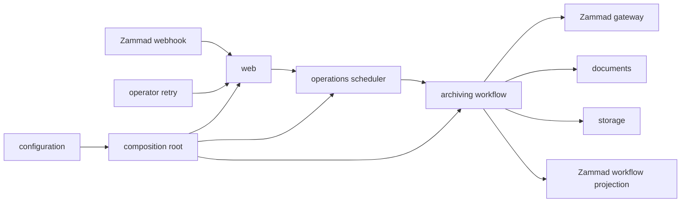

# Architecture

Chronikwerk is a modular monolith. One FastAPI process accepts authenticated Zammad
webhooks and operator retries, runs bounded background archive work, writes an immutable
PDF and JSON audit sidecar, and projects the outcome back to Zammad.

## Runtime flow

```mermaid
flowchart LR
  Z[Zammad webhook] --> W[web]
  O[operator retry] --> W
  W --> Q[operations scheduler]
  Q --> A[archiving workflow]
  A --> ZG[Zammad gateway]
  A --> D[documents]
  A --> S[storage]
  A --> ZP[Zammad workflow projection]
  C[configuration] --> X[composition root]
  X --> W
  X --> Q
  X --> A
```

`POST /ingest` and retry endpoints return `202` only after process-local admission. The
archive workflow fetches ticket data, checks the trigger state, marks the ticket as processing,
normalizes and sanitizes the snapshot, renders and optionally signs the PDF, transactionally
publishes the PDF and sidecar, and then applies terminal tags. The success note is best effort
after storage and terminal tags have succeeded.

## Modules

| Module | Responsibility |
| --- | --- |
| `composition.py` | Converts validated configuration into narrow runtime options and wires concrete dependencies. |
| `archiving/` | Archive attempts, outcomes, workflow ordering, failure policy, notes, and product rules. |
| `zammad/` | Zammad DTOs, bounded transport, resource gateway, and sequential tag/note projection. |
| `documents/` | Snapshot models and mapping, HTML sanitization, templates, PDF rendering, PAdES signing, and RFC3161 timestamping. |
| `storage/` | Path layout, root-confined filesystem operations, audit records, and transactional PDF/sidecar publication. |
| `configuration/` | Settings model, precedence, validation, redaction, and managed non-secret revisions. |
| `operations/` | Volatile job envelopes, admission, scheduling, deduplication, ticket exclusion, history, shutdown, logging, and metrics. |
| `web/` | FastAPI app, public routes, middleware, administration UI/API, templates, and generated static assets. |

## Dependency direction

- `composition.py` may import every concrete module needed to assemble the process.
- `web` depends only on `configuration` and `operations`; it does not implement archival work.
- Archive policy and value modules do not import web, configuration, operations, or concrete
  integration packages.
- `configuration` is foundational; `operations` and `zammad` may depend on it; `documents` may
  depend on those boundary modules; `storage` may depend on document models; and `archiving`
  coordinates the resulting capabilities. Reverse edges are forbidden.
- `failures.py`, `outbound.py`, and `timestamps.py` are small shared contracts for error
  classification, HTTP/DNS trust, and audit timestamps. They cannot import other internal modules.
- `configuration` is a leaf. Runtime feature packages may consume its values only at composition
  or delivery boundaries; archive and storage requests use narrow immutable options.
- Cross-package imports of underscore-prefixed implementation modules are forbidden.

These rules, including the acyclic feature graph, are enforced by architecture tests. The old
`app`, `adapters`, `domain`, `config`, and `observability` package families are intentionally
absent.

## State and consistency

PDF and JSON sidecar files are Chronikwerk's durable state. The sidecar is published last and
signals a complete archive pair. Managed non-secret configuration revisions are also durable and
become active after an external restart.

Admission reservations, running tasks, delivery-ID deduplication, per-ticket exclusion, job
history, and admin sessions are process-local. A crash can lose admitted work, and multiple
instances can race. Those limitations are explicit product contracts, not hidden infrastructure.

Archive publication and Zammad finalization are not one distributed transaction. If storage
succeeds and terminal tag changes fail, the archive pair remains authoritative and operators
reconcile the ticket state. Adding durable jobs, leases, or an outbox would change admission and
operational semantics and requires a separate product decision.

## External boundaries

- HTTP: webhook, batch, retry, health, metrics, history, and administration contracts in
  `docs/api.md`.
- Zammad: fixed `/api/v1` resource shapes, token authentication, deny-by-default outbound
  transport policy, and workflow tags/notes.
- Filesystem: configured archive root, sanitized layout, descriptor-relative symlink-resistant
  writes, atomic replacement, and JSON audit schema.
- Documents: packaged templates, PDF/UA-targeted rendering, optional PAdES signature, and optional
  RFC3161 timestamp.
- Deployment: console scripts, Docker/Compose, and systemd interfaces documented in
  `docs/deploy.md`.

## Where code belongs

Put product rules and archive outcomes in `archiving`; Zammad wire formats and calls in `zammad`;
rendering/signing code in `documents`; filesystem and audit publication in `storage`; settings and
managed revisions in `configuration`; volatile process mechanics in `operations`; and HTTP/admin
delivery in `web`. Shared code belongs in the module that owns the concept, not in a generic helper
package.
