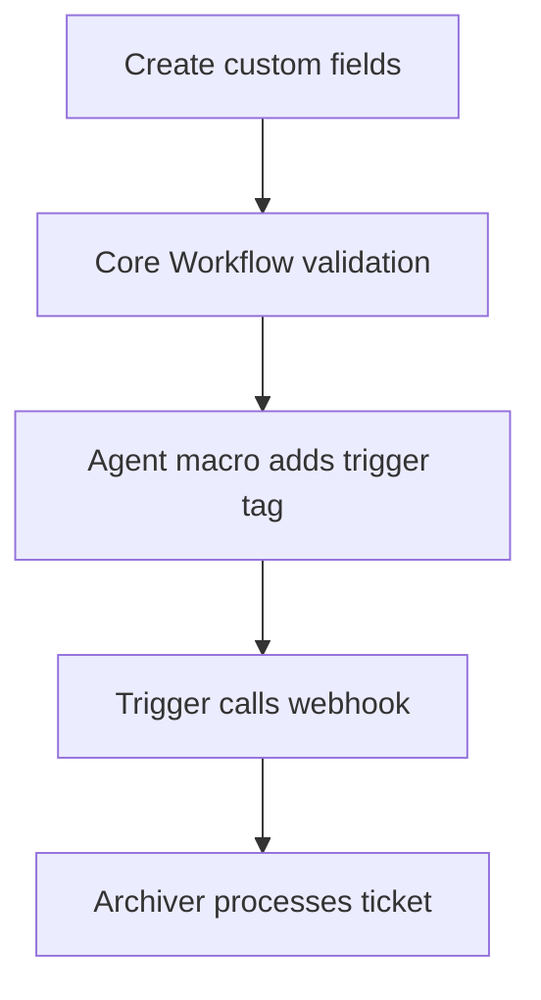

# 02 - Zammad Setup

This guide describes the Zammad-side configuration required to use `zammad-pdf-archiver` safely.

## 1. Prerequisites

- Zammad admin access.
- Reachable archiver endpoint, for example: `https://archiver.example.com/ingest`.
- Archiver service configured with one of:
  - `WEBHOOK_HMAC_SECRET` (recommended)
  - `HARDENING_WEBHOOK_ALLOW_UNSIGNED=true` (internal/testing only)

## 2. Create Ticket Custom Fields

Required by archiver logic:
- `archive_path`
- `archive_user_mode`

Required when `archive_user_mode=fixed`:
- `archive_user`

Optional helper field for Zammad-side gating:
- `archive_request` (boolean)

Important mapping notes:
- `archive_path` and `archive_user_mode` names are configurable in archiver settings.
- `archive_user` field name is fixed in code (`custom_fields.archive_user`).

Suggested field definitions:

| Technical name | Type | Required | Notes |
|---|---|---|---|
| `archive_path` | Tree/select/text | yes | Prefer controlled values over free text |
| `archive_user_mode` | Single select | yes | Allowed: `owner`, `current_agent`, `fixed` |
| `archive_user` | User/text | conditional | Required only for `fixed` mode |
| `archive_request` | Boolean | optional | Useful for workflow/trigger filters |

Admin path:
1. `Admin -> Objects -> Ticket`
2. Add fields with exact technical names.
3. Ensure visibility for relevant roles/groups.

## 3. Add Core Workflow Validation Rules

Recommended rules:

1. If `archive_request=true`, require `archive_path` and `archive_user_mode`.
2. If `archive_request=true` and `archive_user_mode=fixed`, require `archive_user`.

Admin path:
1. `Admin -> Core Workflows`
2. Create and save the rules.
3. Validate with an agent account.

## 4. Create Agent Macro

Create a macro that requests archiving.

Admin path:
1. `Admin -> Manage -> Macros`
2. Example name: `Archive (sign PDF)`
3. Actions:
  - add tag `pdf:sign` (or your configured trigger tag)
  - optionally set `archive_request=true`
4. Save and assign to agent roles.

## 5. Configure Webhook

Admin path:
1. `Admin -> Webhooks` (or `Admin -> Integrations -> Webhooks`, version-dependent)
2. Create webhook:
  - URL: `https://archiver.example.com/ingest`
  - Method: `POST`
  - Content-Type: `application/json`
  - Enable HMAC signing if available
  - Use SHA1 signature format (`X-Hub-Signature: sha1=<hex>`)

If HMAC is enabled:
- Generate secret: `openssl rand -hex 32`
- Set same secret in Zammad and archiver (`WEBHOOK_HMAC_SECRET`)

## 6. Create Trigger

Create a trigger that calls the webhook.

Minimum safe condition:
- ticket has trigger tag (`pdf:sign` by default)

Recommended additional condition:
- `archive_request=true`

Action:
- call webhook created in step 5.

## 7. End-to-End Smoke Test

1. Open a test ticket.
2. Fill required fields:
  - `archive_path`
  - `archive_user_mode`
  - `archive_user` (if mode is `fixed`)
3. Apply macro.
4. Confirm webhook returns HTTP `202` in Zammad.
5. Confirm ticket transitions:
  - temporary `pdf:processing`
  - final `pdf:signed` on success or `pdf:error` on failure
6. Confirm internal note from archiver is added.

## 8. Common Setup Issues

### `403 forbidden` from `/ingest`

- HMAC secret mismatch.
- Wrong signature header format.
- Body altered by proxy after signing.

### `400 missing_delivery_id`

Cause:
- archiver has `hardening.webhook.require_delivery_id=true`
- webhook request did not include `X-Zammad-Delivery`

### Trigger does not fire

Check:
- macro actually adds trigger tag
- trigger conditions match updated ticket state
- workflow rules are not blocking updates

### Ticket ends in `pdf:error`

Zammad setup may be correct; failure can be downstream.
See:
- [`07-storage.md`](07-storage.md)
- [`08-operations.md`](08-operations.md)
