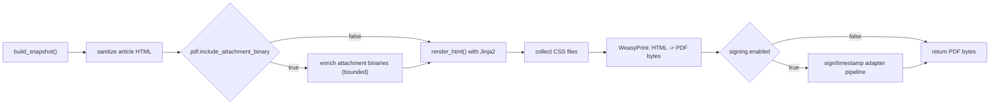

# 05 - PDF Rendering

This document defines the rendering contract used by the PDF pipeline.

## 1. Rendering Pipeline

Code paths:
- `src/zammad_pdf_archiver/adapters/snapshot/build_snapshot.py`
- `src/zammad_pdf_archiver/adapters/pdf/template_engine.py`
- `src/zammad_pdf_archiver/adapters/pdf/render_pdf.py`

## 2. Template Variants

Built-in variants:
- `src/zammad_pdf_archiver/templates/default/`
- `src/zammad_pdf_archiver/templates/minimal/`
- `src/zammad_pdf_archiver/templates/compact/`

Runtime selection:
- YAML: `pdf.template_variant`
- env: `PDF_TEMPLATE_VARIANT`

Optional template root override:
- env: `TEMPLATES_ROOT`

When `TEMPLATES_ROOT` is set, templates are loaded from:
- `<TEMPLATES_ROOT>/<template_variant>/ticket.html`
- CSS files in same variant directory

## 3. Template Context Contract (Sandbox)

The Jinja context is restricted to a minimal whitelist (Bug #39): only these variables are passed; no config, request, or other application state.

Jinja variables provided:
- `snapshot`
- `ticket` (alias: `snapshot.ticket`)
- `articles` (alias: `snapshot.articles`)

Snapshot schema:
- `ticket.id`, `ticket.number`, `ticket.title`
- `ticket.created_at`, `ticket.updated_at`
- `ticket.customer`, `ticket.owner`
- `ticket.tags`
- `ticket.custom_fields`
- article fields:
  - `id`, `created_at`, `internal`, `sender`, `subject`
  - `body_html`, `body_text`
  - `attachments[]`

Schema source:
- `src/zammad_pdf_archiver/domain/snapshot_models.py`

## 4. Template File Requirements

Required per variant:
- `ticket.html`
- at least one CSS file (`styles.css` recommended)

Optional:
- additional `*.css` in variant root
- additional CSS files under `<variant>/css/` (recursive)

Failure behavior:
- missing template folder/file -> permanent processing failure
- no CSS files found -> permanent processing failure

## 5. HTML Safety Model

- Jinja autoescape is enabled for HTML templates.
- Article HTML (`body_html`) is sanitized in `build_snapshot()` before it is passed to the template context (Bug #19). Templates use `|safe` on this already-sanitized content; the pipeline does not trust raw upstream HTML.
- Sanitizer behavior:
  - drops active content (`script`, `style`, `iframe`, form controls, etc.)
  - strips event handlers and inline styles
  - restricts links to safe schemes (`http`, `https`, `mailto`)
- If sanitized HTML becomes empty, renderer falls back to `body_text`.

Sanitizer implementation:
- `src/zammad_pdf_archiver/domain/html_sanitize.py`

## 6. Rendering Limits

Setting:
- `pdf.max_articles` / `PDF_MAX_ARTICLES`
- `pdf.article_limit_mode` / `PDF_ARTICLE_LIMIT_MODE`

Behavior:
- `max_articles > 0` and over limit:
  - `article_limit_mode=fail` -> permanent error
  - `article_limit_mode=cap_and_continue` -> articles are truncated to the limit and processing continues
- `max_articles=0`: disables the article count limit

## 7. PDF Output Contract

- Output is PDF bytes (expected `%PDF-` header).
- Render step is deterministic for same snapshot/template/CSS inputs.
- PDF identifier is derived from SHA-256 of rendered HTML + CSS bytes.

## 8. Customization Workflow

1. Copy a built-in variant (`default`, `minimal`, or `compact`) to a new variant folder.
2. Keep `ticket.html` and at least one CSS file.
3. Adjust HTML/CSS to your output requirements.
4. Set `pdf.template_variant` to your variant name.
5. Validate with realistic ticket samples before production.

## 9. Current Limitations

- Attachments are represented as metadata in the PDF. Optionally, when `pdf.include_attachment_binary=true`, attachment binaries are fetched, written to an `attachments/` directory next to the PDF, and listed in the audit sidecar (see [config-reference](config-reference.md)).
- Template datetime formatting is template-defined; `pdf.locale` and `pdf.timezone` are currently configuration fields without locale-aware template helpers.
