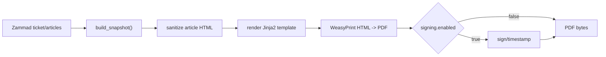

# 05 - PDF Rendering

The PDF pipeline builds a snapshot, renders bundled HTML templates, and converts
the result to PDF bytes with WeasyPrint.

## Pipeline

```mermaid
flowchart LR
  A["Zammad ticket/articles"] --> B["build_snapshot()"]
  B --> C["sanitize article HTML"]
  C --> D["render Jinja2 template"]
  D --> E["WeasyPrint HTML -> PDF"]
  E --> F{"signing.enabled"}
  F -->|"false"| G["PDF bytes"]
  F -->|"true"| H["sign/timestamp"]
  H --> G
```

Code paths:

- `src/chronikwerk/documents/snapshot.py`
- `src/chronikwerk/documents/templates.py`
- `src/chronikwerk/documents/pdf.py`
- `src/chronikwerk/documents/templates/`

## Template Contract

Bundled template:

- `src/chronikwerk/documents/templates/default/ticket.html`

Provided variables:

- `snapshot`
- `ticket` (`snapshot.ticket`)
- `articles` (`snapshot.articles`)
- `articles_total`, `articles_included`, and `articles_omitted`
- normalized `pdf_locale` (`de-DE` or `en-GB`) and localized labels

Article fields include:

- `id`
- `created_at`
- `internal`
- `sender`
- `subject`
- `body_html`
- `body_text`
- `attachments[]`

## HTML Safety

- Jinja autoescape is enabled.
- Article bodies marked as HTML (or containing common markup) are processed by
  a dependency-free allowlist sanitizer before rendering.
- Rich formatting, tables, and safe links are retained; scripts, styles, forms,
  event-handler/style attributes, and dangerous or scheme-relative URLs are
  removed.
- Malformed markup is recovered into a bounded fragment. If sanitization fails,
  the source is escaped and rendered through the plain-text fallback.
- Attachment binaries are not fetched or archived; attachment metadata is
  rendered only in the PDF.

## Limits

Relevant settings:

- `PDF__MAX_ARTICLES`
- `PDF__ARTICLE_LIMIT_MODE`
Attachments are represented as metadata only (`filename`, size, content type,
and IDs). Attachment binaries are not archived and there is no attachment-byte
limit setting. Article limits still fail the job or cap and continue according
to `PDF__MAX_ARTICLES` and `PDF__ARTICLE_LIMIT_MODE`.

When `cap_and_continue` omits articles, the PDF displays total, included, and omitted
counts prominently and the sidecar records the same coverage. The document never reports
a capped export as complete.

## Accessibility and pagination

Archive PDFs use semantic heading levels, a meaningful outline, full language metadata,
page identity, page counters, DejaVu Sans, and WeasyPrint's `pdf/ua-1` output variant.
Articles may split across pages; headings, short attachment rows, metadata blocks, and
table rows avoid orphaning where practical. Long URLs, preformatted text, images, and
wide tables are contained within A4 bounds.

The renderer option is not a conformance claim. Release validation requires veraPDF
1.30.1 with profile `ua1` for signed and unsigned fixtures plus human reading-order,
outline, language, and assistive-technology checks.

Ticket pipelines may run concurrently, but entry into the native WeasyPrint/
FontConfig/Pango renderer is serialized inside worker threads. This keeps native
renderer state off the event loop and prevents concurrent render calls from
crashing the service process.
