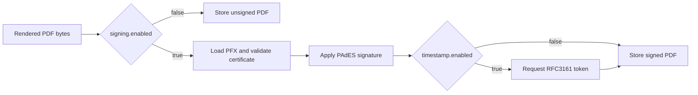

# 06 - Signing and Timestamp

This service supports:
- PAdES PDF signing
- optional RFC3161 timestamping (TSA)

## 1. Signing Flow



Code:
- `src/zammad_pdf_archiver/adapters/signing/sign_pdf.py`

Current signing behavior:
- enabled by `signing.enabled=true`
- requires `signing.pfx_path`
- validates cert validity window before signing
- uses invisible signature field `Signature1`

## 2. Implemented Material Type

Implemented signer input:
- PKCS#12/PFX bundle (`signing.pfx_path`, `signing.pfx_password`)

Compatibility keys exist in settings but are not used by current signer:
- `signing.pades.cert_path`
- `signing.pades.key_path`
- `signing.pades.key_password`

## 3. RFC3161 Timestamping

Code:
- `src/zammad_pdf_archiver/adapters/signing/tsa_rfc3161.py`

Behavior:
- timestamping is controlled by `signing.timestamp.enabled`
- TSA URL required: `signing.timestamp.rfc3161.tsa_url`
- request uses strict response checks:
  - HTTP status must be `200`
  - `Content-Type` must be `application/timestamp-reply`
- optional basic auth is env-only:
  - `TSA_USER`
  - `TSA_PASS`

Important:
- Timestamping is executed only inside signing flow.
- If signing is disabled, no TSA call is made.

## 4. Configuration Examples

### YAML

```yaml
signing:
  enabled: true
  pfx_path: "/run/secrets/signing.pfx"
  pfx_password: null
  pades:
    reason: "Ticket archive"
    location: "Datacenter"
  timestamp:
    enabled: true
    rfc3161:
      tsa_url: "https://tsa.example.local/rfc3161"
      timeout_seconds: 10
      ca_bundle_path: null
```

### Environment

```bash
SIGNING_ENABLED=true
SIGNING_PFX_PATH=/run/secrets/signing.pfx
SIGNING_PFX_PASSWORD=change-me
TSA_ENABLED=true
TSA_URL=https://tsa.example.local/rfc3161
TSA_TIMEOUT_SECONDS=10
TSA_CA_BUNDLE_PATH=/etc/ssl/certs/tsa-ca.pem
TSA_USER=tsa-user
TSA_PASS=tsa-pass
```

## 5. Failure Classification

Timestamp adapter classification:
- transient:
  - network/request errors
  - HTTP `5xx`
- permanent:
  - HTTP `4xx`
  - malformed content type/body
  - missing TSA config
  - partial basic auth configuration

Signing adapter typical permanent failures:
- missing PFX path/file
- wrong or missing PFX password
- invalid/corrupt PKCS#12 bundle
- certificate not yet valid or expired
- pyHanko signing errors

These classifications feed ticket tag behavior in `process_ticket`.

## 6. Verification

Scripts:
- `scripts/ops/verify-pdf.sh`
- `scripts/ops/verify-pdf.py`

Example:

```bash
scripts/ops/verify-pdf.sh /path/to/file.pdf
```

Expected output:
- `PASS` for successful verification
- `FAIL` with diagnostics otherwise

## 7. Limitations

- Signature appearance is invisible (no visual stamp).
- No built-in long-term validation profile management (LTV).
- Long-term trust depends on external trust anchors, revocation evidence, TSA policy retention, and storage controls.
