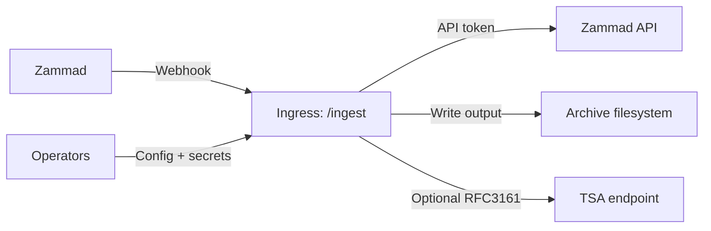

# 09 - Security

This document summarizes the service threat model and implemented mitigations.

## 1. Trust Boundaries

## 2. Security-Relevant Assets

- webhook secret (`WEBHOOK_HMAC_SECRET` / legacy `WEBHOOK_SHARED_SECRET`)
- Zammad API token (`ZAMMAD_API_TOKEN`)
- signing material (`SIGNING_PFX_PATH`, `SIGNING_PFX_PASSWORD`)
- TSA credentials (`TSA_USER`, `TSA_PASS`)
- archive outputs (PDFs + sidecar checksums)

## 3. Threats and Mitigations

### Threat: forged webhook requests

Mitigations:
- HMAC verification (`X-Hub-Signature: sha1=<hex>`) using `hmac.compare_digest`
- fail-closed default when no webhook secret is configured
- unsigned mode requires explicit opt-in

### Threat: replayed/duplicate webhook delivery

Mitigations:
- in-memory TTL dedupe keyed by `X-Zammad-Delivery`
- optional strict delivery ID requirement

Residual risk:
- dedupe state is process-local and reset on restart

### Threat: path traversal or arbitrary file write

Mitigations:
- strict segment validation and deterministic sanitization
- root confinement (`ensure_within_root`)
- symlink traversal rejection under storage root
- atomic replace writes

### Threat: secret leakage in logs or ticket notes

Mitigations:
- recursive event redaction for secret-like keys and secret objects
- free-text secret scrubbing in exception messages
- ticket error notes use scrubbed exception text

### Threat: request flood / oversized payload DoS

Mitigations:
- body size limit middleware (`MAX_BODY_BYTES`)
- token-bucket rate limiting (`RATE_LIMIT_*`)

### Threat: unsafe upstream transport settings

Mitigations:
- plaintext HTTP upstreams blocked by default
- TLS verification disable blocked by default
- loopback/link-local upstream hosts blocked by default
- explicit hardening overrides required for unsafe modes

### Threat: archive tampering on shared storage

Mitigations in application:
- deterministic paths
- controlled write flow
- SHA-256 sidecar checksum
- optional cryptographic PDF signing/timestamping

Operational controls required:
- least-privilege share credentials and ACLs
- snapshot/immutability policy at storage layer
- periodic integrity verification

## 4. Residual Risks

- no distributed durable dedupe store
- no built-in immutable/WORM enforcement
- app-level checks cannot fully remove TOCTOU risk on hostile filesystems
- archive long-term trust depends on external trust and storage controls

## 5. Hardening Checklist

- restrict network access to `/ingest` to trusted sources
- configure and rotate webhook HMAC secret
- keep body/rate limits enabled and tuned
- require delivery IDs when available
- protect `/metrics` access when enabled
- secure and monitor storage mount permissions
- keep signing/TSA credentials in secrets management, not source-controlled files
