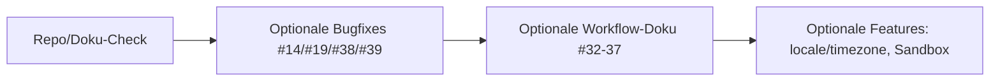

# Plan: Repo Cleanup, Doku, Deduplizierung, Refactoring, QoL, Features und UI

Überblick über bereits Erledigtes, verbleibende Schritte und optionale Backlog-Punkte. Referenz: [BUGS_AND_FIXES.md](BUGS_AND_FIXES.md).

---

## 1. Repo Cleanup

### Ziel
- Build-/Cache-Artefakte nicht im Repo; Skripte dokumentiert; keine unnötigen Duplikate.

### Bereits erledigt
- [docs/08-operations.md](08-operations.md) Abschnitt **9. Scripts**: Tabelle aller Skripte (`scripts/ci/smoke-test.sh`, `scripts/dev/run-local.sh`, `scripts/dev/gen-dev-certs.sh`, `scripts/ops/verify-pdf.sh`, `verify-pdf.py`, `scripts/ops/mount-cifs.sh`).
- Hinweis zu `git clean -fdx` für lokale Caches in 08-operations.
- `.gitignore` deckt `.mypy_cache/`, `dist/`, `build/`, `node_modules`, `.cursor/`, `.codex/`, `audit/` ab.

### Verbleibend / optional
- **Abgleich:** Prüfen, ob versehentlich getrackte Dateien in `.gitignore` stehen; bei Bedarf einmalig `git status` / `git clean -ndx` prüfen.
- **Skripte:** `verify-pdf.sh` ist Wrapper um `verify-pdf.py`/pyhanko – bereits in Scripts-Tabelle beschrieben; keine Änderung nötig.

---

## 2. Dokumentation und Artefakte bereinigen

### Ziel
- Redundanzen reduzieren, zentrale Stellen verlinken, keine unnötigen Docs löschen.

### Bereits erledigt
- [CODE_OF_CONDUCT.md](../CODE_OF_CONDUCT.md): Klare Meldemöglichkeit (Verweis auf README/contact).
- [README.md](../README.md): Dokumentationsindex inkl. ADR, BUGS_AND_FIXES, release-checklist, Stuck-in-pdf:processing → FAQ, Redis-Empfehlung.
- [docs/09-security.md](09-security.md): Verweis auf release-checklist.
- [docs/08-operations.md](08-operations.md): Residual risks, Link zu release-checklist.

### Verbleibend / Entscheidungen
| Thema | Option A | Option B |
|-------|----------|----------|
| **00-overview.md** | Behalten als Kurzreferenz (Scope, Non-goals); README verweist bereits darauf. | In README integrieren und Datei entfernen. |
| **BUGS_AND_FIXES.md** | Bleibt in `docs/` (wie jetzt), im README verlinkt. | Nach `.github/` verschieben, falls als Issue-Template-Referenz genutzt. |
| **docs/images/** | [images/README.md](images/README.md) belassen (Hinweise zu SVG/PNG, keine sensiblen Daten). | Mit konkreten Diagrammen füllen und in 01-architecture/README verlinken. |

**Nicht löschen:** PRD, api.md, config-reference.md, deploy.md, faq.md, nummerierte Guides (01–09), ADR, GitHub ISSUE_TEMPLATE/PULL_REQUEST_TEMPLATE.

---

## 3. Code-Verbesserungen (BUGS_AND_FIXES)

### Bereits umgesetzt
- **Ingest:** ticket_id-Precedence (#11), Delivery-ID strip (#24), 503 bei fehlendem Settings (#25).
- **process_ticket:** BaseException/CancelledError (#15), `asyncio.shield(_release_ticket)` (#16).
- **Storage:** Validierung vor `ensure_dir` (#13/#20), fchmod in write_bytes/write_atomic_bytes (#21/#40), `allow_prefixes=[]` = kein Pfad erlaubt (#30).
- **WeasyPrint:** Sicherem `url_fetcher` (#18), [adapters/pdf/url_fetcher.py](../src/zammad_pdf_archiver/adapters/pdf/url_fetcher.py).
- **Redaction:** JSON/dict, Env-Var-Zeilen, api_key/apikey (#22, #23, #42) in [config/redact.py](../src/zammad_pdf_archiver/config/redact.py).
- **HMAC:** allow_unsigned_when_no_secret (#12), Body vor 403 drainen + Disconnect = Auth-Fehler (#27, #28).
- **Idempotency:** Redis atomarer try_claim (#17).
- **build_filename:** Leere/dot-Segmente, max. Länge (#31) in [adapters/storage/layout.py](../src/zammad_pdf_archiver/adapters/storage/layout.py).
- **Klarere Fehlermeldungen:** Stabile Codes/Hints bei Permanent-Fehlern (#7) in process_ticket.
- **Durable Queue:** Dokumentiert als best-effort (#26) in README, 08-operations, faq.

### Noch offen (Backlog / optional)
- **#14/#41** O_NOFOLLOW: Auf Plattformen ohne Unterstützung dokumentieren oder fail-closed (09-security oder 07-storage).
- **#19** HTML: In Doku festhalten, dass Artikel-Body in build_snapshot sanitized wird und Templates `|safe` auf bereinigten Inhalt anwenden.
- **#38** Template-Name: Bereits Allowlist; ggf. weitere Härtung (keine relativen Pfade).
- **#39** Template-Sandbox: Jinja-Kontext auf minimale Whitelist beschränken.
- **#32–#37** Workflow/Idempotency: In-flight prozessübergreifend, should_process/pdf:processing/pdf:error, TOCTOU, Orphans, Claim-Reihenfolge – teils dokumentieren, teils kleine Code-Anpassungen.

---

## 4. Code-Deduplizierung

### Bereits erledigt
- **ticket_custom_fields:** Eine Implementierung in [domain/ticket_utils.py](../src/zammad_pdf_archiver/domain/ticket_utils.py); process_ticket und build_snapshot importieren von dort.
- **_format_timestamp_utc:** Nur [domain/audit.py](../src/zammad_pdf_archiver/domain/audit.py); process_ticket importiert.
- **Timeouts:** [adapters/http_util.py](../src/zammad_pdf_archiver/adapters/http_util.py) `timeouts_for()`; Zammad-Client und TSA-Adapter nutzen es.
- **Template-Name-Validierung:** Zentrale Allowlist in [adapters/pdf/template_engine.py](../src/zammad_pdf_archiver/adapters/pdf/template_engine.py) `validate_template_name`; render_pdf nutzt sie.

### Weitere Duplikate
- Keine bekannten verbleibenden inhaltlichen Duplikate; bei neuen Features darauf achten, gemeinsame Hilfen in domain/ oder adapters zu bündeln.

---

## 5. Code-Refactoring

### Bereits erledigt
- **API-Fehlerantworten:** [app/responses.py](../src/zammad_pdf_archiver/app/responses.py) mit `api_error(status_code, detail, code=None, hint=None)`; Middleware (hmac, body_size_limit, rate_limit) und Route ingest nutzen sie.
- **JSONResponse:** Einheitlich `starlette.responses.JSONResponse`; alle Fehlerantworten über `api_error()`.

### Optional
- Domain-Layer für „ticket custom fields“ und „timestamp format“ ist bereits über ticket_utils und audit abgedeckt; Jobs rufen Domain/Adapter auf.

---

## 6. QoL-Verbesserungen

### Bereits umgesetzt
- **Konfigurierbarer Feldname archive_user:** `fields.archive_user` in Settings; process_ticket nutzt `archive_user_field_name`.
- **article_limit_mode cap_and_continue:** Config-Option; bei Überschreitung Artikel kappen, Warnung loggen, PDF erzeugen.
- **Klarere Fehlermeldungen:** Codes/Hints in Ticket-Note und Log (#7).
- **Doku:** Residual risks, release-checklist, Stuck in pdf:processing, Redis-Empfehlung.

### Optional
- **pdf.locale / pdf.timezone:** Config-Felder existieren; in Jinja-Filtern/Globals für Datums-/Zeitzonen-Ausgabe nutzen (siehe 05-pdf-rendering.md).

---

## 7. Mögliche neue Funktionen

- **Configurable archive_user** – erledigt.
- **Article limit cap_and_continue** – erledigt.
- **pdf.locale / pdf.timezone in Templates:** Optional; für lokalisierte Datums-/Zahlenformatierung.
- **Redis als empfohlene Idempotency-Option:** In README/08-operations bereits hervorgehoben.
- **Durable Queue:** Nur dokumentiert (best-effort); als zukünftiges Feature erwähnt.

---

## 8. Mögliche UI- (PDF-)Verbesserungen

### Bereits umgesetzt
- **WeasyPrint url_fetcher:** Sicher (kein file://, eingeschränkte Hosts) (#18).
- **Accessibility:** aria-label in minimal/compact (z. B. „Ticket articles“ am `<main>`).
- **HTML:** build_snapshot sanitized Artikel-Body; Templates nutzen `|safe` auf diesen Inhalt (#19 – optional in Doku explizit festhalten).

### Optional
- **Sprache/Locale:** `lang`-Attribut aus Config (`pdf.locale`); Nutzung von pdf.locale/timezone in Templates.
- **Template-Sandbox (#39):** Jinja-Kontext auf minimale Whitelist (snapshot, ticket, articles) beschränken.

---

## 9. Performance (optional, wo sinnvoll)

Angelehnt an Python-Performance-Best-Practices; nur bei nachgewiesenen Engpässen anwenden:

- **Hot Paths:** Ingest → process_ticket → Zammad/PDF/Storage; keine unnötigen Allokationen in Schleifen.
- **I/O:** Schreibvorgänge bereits atomic/fsync-konfigurierbar; Batch-/Streaming-Logik nur bei großen Tickets prüfen.
- **Caching:** Delivery-ID und Idempotency bereits über Redis/Memory; kein zusätzlicher App-Cache nötig, außer für teure Berechnungen (derzeit keine).
- **Profiling:** Bei Performance-Fragen zuerst cProfile/py-spy nutzen, dann gezielt optimieren (nicht vorschnell).

---

## 10. Implementierungsreihenfolge für Verbleibendes

1. **Repo/Doku:** Einmalig .gitignore/clean prüfen; Entscheidung 00-overview behalten vs. integrieren; BUGS_AND_FIXES Ort beibehalten.
2. **Optionale Bugfixes:** #14/#41 O_NOFOLLOW Doku; #19 HTML-Sanitizer-Doku; #38/#39 Template-Härtung/Sandbox.
3. **Workflow/Idempotency:** #32–#37 teils dokumentieren, teils kleine Anpassungen (Reihenfolge Claim/should_process, Orphans, TOCTOU).
4. **Optionale Features:** pdf.locale/timezone in Templates; Template-Sandbox (#39).

---

## 11. Kurzreferenz: Wichtige Dateien

| Bereich | Dateien |
|--------|---------|
| Einstieg/Server | [src/main.py](../src/main.py), [runtime.py](../src/zammad_pdf_archiver/runtime.py), [app/server.py](../src/zammad_pdf_archiver/app/server.py) |
| Jobs/Ingest | [app/jobs/process_ticket.py](../src/zammad_pdf_archiver/app/jobs/process_ticket.py), [app/routes/ingest.py](../src/zammad_pdf_archiver/app/routes/ingest.py) |
| Middleware | [app/middleware/hmac_verify.py](../src/zammad_pdf_archiver/app/middleware/hmac_verify.py), [app/responses.py](../src/zammad_pdf_archiver/app/responses.py) |
| Adapter | [adapters/zammad/client.py](../src/zammad_pdf_archiver/adapters/zammad/client.py), [adapters/snapshot/build_snapshot.py](../src/zammad_pdf_archiver/adapters/snapshot/build_snapshot.py), [adapters/pdf/render_pdf.py](../src/zammad_pdf_archiver/adapters/pdf/render_pdf.py), [adapters/storage/layout.py](../src/zammad_pdf_archiver/adapters/storage/layout.py) |
| Domain | [domain/audit.py](../src/zammad_pdf_archiver/domain/audit.py), [domain/ticket_utils.py](../src/zammad_pdf_archiver/domain/ticket_utils.py), [domain/path_policy.py](../src/zammad_pdf_archiver/domain/path_policy.py) |
| Config | [config/settings.py](../src/zammad_pdf_archiver/config/settings.py), [config/redact.py](../src/zammad_pdf_archiver/config/redact.py) |
| Docs | [README.md](../README.md), [docs/BUGS_AND_FIXES.md](BUGS_AND_FIXES.md), [docs/08-operations.md](08-operations.md), [docs/faq.md](faq.md) |
