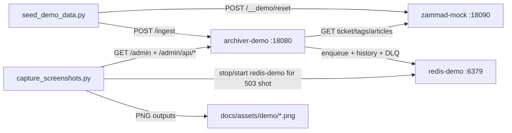

# Local Demo Tutorial: Mock University + Mock Data + Automated Screenshots

This tutorial creates a fully local and reproducible demo stack for `zammad-ticket-archiver`.

The demo is self-contained:
- mock Zammad API with fictional university tickets,
- Redis-backed queue processing,
- deterministic history seed,
- Playwright screenshot automation.

## Demo Architecture

`docker-compose.demo.yml` starts three services:
- `archiver-demo` on `http://127.0.0.1:18080`
- `zammad-mock` on `http://127.0.0.1:18090`
- `redis-demo` (optional host port `16379`)

Flow:
1. Seed script resets mock data (`POST /__demo/reset`).
2. Seed script posts ingest events to `archiver-demo`.
3. Archiver fetches ticket/tags/articles from `zammad-mock`.
4. Queue worker writes job history and DLQ entries to Redis.
5. Screenshot script captures Admin UI + API states.



## Prerequisites

- Docker + Docker Compose plugin (`docker compose`)
- Python 3.12+
- Dev dependencies installed:

```bash
pip install -e ".[dev]"
```

- Playwright browser installed (one-time):

```bash
python -m playwright install chromium
```

## End-to-End (4 commands)

```bash
make demo-up
make demo-seed
make demo-shots
make demo-down
```

The first three commands are enough to reproduce all demo artifacts.

## Commands in Detail

### 1) Start stack

```bash
make demo-up
```

What it does:
- builds demo containers,
- starts `redis-demo`, `zammad-mock`, `archiver-demo`,
- waits for health checks.

### 2) Seed deterministic history

```bash
make demo-seed
```

What it does:
- resets mock state,
- posts deterministic `/ingest` events,
- generates mixed outcomes (`processed`, `failed_permanent`, `skipped_not_triggered`),
- writes report:
  - `docs/assets/demo/demo-seed-report.json`

Optional backend outage simulation (for manual checks):

```bash
python scripts/demo/seed_demo_data.py --simulate-backend-unavailable
```

### 3) Capture screenshots (Extended Set 10)

```bash
make demo-shots
```

Output directory:
- `docs/assets/demo/`

Expected filenames:
1. `01-admin-token-screen.png`
2. `02-admin-queue-stats.png`
3. `03-admin-history-all.png`
4. `04-admin-history-filtered-ticket.png`
5. `05-admin-retry-action.png`
6. `06-admin-dlq-before-drain.png`
7. `07-admin-dlq-after-drain.png`
8. `08-api-401-unauthorized.png`
9. `09-api-503-backend-unavailable.png`
10. `10-admin-mobile-viewport.png`

### 4) Clean shutdown

```bash
make demo-down
```

Stops containers and removes demo volumes.

## Screenshot Matrix

| File | What it shows |
| --- | --- |
| `01-admin-token-screen.png` | Admin dashboard before token-based data loading |
| `02-admin-queue-stats.png` | Queue stats with authenticated token |
| `03-admin-history-all.png` | Full history list |
| `04-admin-history-filtered-ticket.png` | History filtered by ticket ID |
| `05-admin-retry-action.png` | Retry action response |
| `06-admin-dlq-before-drain.png` | DLQ state before drain |
| `07-admin-dlq-after-drain.png` | DLQ state after drain |
| `08-api-401-unauthorized.png` | Unauthorized API call (`401`) |
| `09-api-503-backend-unavailable.png` | Backend unavailable (`503`) during Redis stop |
| `10-admin-mobile-viewport.png` | Admin dashboard in mobile viewport (`390x844`) |

## Dataset and Scripts

- Dataset:
  - `examples/demo/mock_university_dataset.json`
- Mock API service:
  - `scripts/demo/mock_zammad_api.py`
- Seed script:
  - `scripts/demo/seed_demo_data.py`
- Screenshot script:
  - `scripts/demo/capture_screenshots.py`
- Screenshot manifest:
  - `docs/assets/demo/screenshot-manifest.json`

## Troubleshooting

### `make demo-up` fails on startup

- Check Docker daemon is running.
- Rebuild cleanly:

```bash
docker compose -f docker-compose.demo.yml down -v --remove-orphans
docker compose -f docker-compose.demo.yml up -d --build
```

### `make demo-seed` cannot reach services

- Verify health endpoints:

```bash
curl -s http://127.0.0.1:18080/healthz
curl -s http://127.0.0.1:18090/healthz
```

- Confirm containers are healthy:

```bash
docker compose -f docker-compose.demo.yml ps
```

### `make demo-shots` complains about Playwright

Install Chromium once:

```bash
python -m playwright install chromium
```

### Screenshot set incomplete

- Re-run capture directly for diagnostics:

```bash
python scripts/demo/capture_screenshots.py --headed
```

- Ensure `make demo-seed` ran before screenshots.

## Stability and Security Notes

- Demo tokens are static and local-only (`demo-token`, `demo-admin-token`).
- Demo endpoints and settings are isolated in `docker-compose.demo.yml`.
- No production defaults are modified by running the demo workflow.
