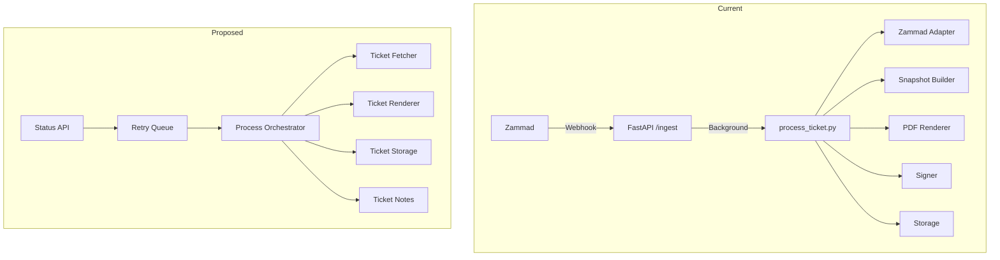

# Zammad PDF Archiver - Comprehensive Improvement Plan

**Created:** 2026-02-24  
**Status:** Draft for Review

---

## Executive Summary

This plan outlines comprehensive improvements for the `zammad-pdf-archiver` project across seven key areas: repository cleanup, documentation optimization, code improvements, deduplication, refactoring, quality-of-life enhancements, and new features.

---

## 1. Repository Cleanup

### 1.1 Duplicate Template Directories

**Issue:** Two template directories exist with nearly identical content:
- [`templates/`](templates/) - Root level
- [`src/zammad_pdf_archiver/templates/`](src/zammad_pdf_archiver/templates/) - Package embedded

**Analysis:**
- Both contain `default/`, `minimal/`, and `compact/` variants
- Files are nearly identical but have minor formatting differences
- The `src/zammad_pdf_archiver/templates/` version uses `format_dt_local` filter while root version uses `strftime`

**Recommendation:**
- [ ] Remove root-level [`templates/`](templates/) directory
- [ ] Keep only [`src/zammad_pdf_archiver/templates/`](src/zammad_pdf_archiver/templates/) as the source of truth
- [ ] Update any references in documentation or configuration

### 1.2 Remove Unnecessary `.keep` Files

**Files to review:**
- [`test/fixtures/.keep`](test/fixtures/.keep)
- [`test/integration/.keep`](test/integration/.keep)
- [`test/unit/.keep`](test/unit/.keep)
- [`src/zammad_pdf_archiver/templates/default/partials/.keep`](src/zammad_pdf_archiver/templates/default/partials/.keep)
- [`templates/default/partials/.keep`](templates/default/partials/.keep)

**Recommendation:**
- [ ] Remove `.keep` files if directories have other content
- [ ] Add `__init__.py` to test directories if needed for Python imports

### 1.3 Root Directory Files Review

**Files to evaluate:**
- [`CODE_OF_CONDUCT.md`](CODE_OF_CONDUCT.md) - Standard file, keep
- [`CONTRIBUTING.md`](CONTRIBUTING.md) - Standard file, keep
- [`SECURITY.md`](SECURITY.md) - Standard file, keep
- [`CHANGELOG.md`](CHANGELOG.md) - Standard file, keep
- [`LICENSE`](LICENSE) - Standard file, keep

**Recommendation:**
- [ ] Keep all standard OSS files
- [ ] Ensure CHANGELOG is updated with releases

---

## 2. Documentation Optimization

### 2.1 Documentation Structure Analysis

Current documentation structure:
```
docs/
├── 00-overview.md          # Overview (77 lines)
├── 01-architecture.md      # Architecture details
├── 02-zammad-setup.md      # Zammad configuration
├── 03-data-model.md        # Data models
├── 04-path-policy.md       # Path policies
├── 05-pdf-rendering.md     # PDF rendering
├── 06-signing-and-timestamp.md  # Signing/TSA
├── 07-storage.md           # Storage behavior
├── 08-operations.md        # Operations guide
├── 09-security.md          # Security model
├── api.md                  # API reference
├── config-reference.md     # Configuration (210 lines)
├── faq.md                  # FAQ (97 lines)
├── PRD.md                  # Product requirements (271 lines)
├── release-checklist.md    # Release checklist
├── deploy.md               # Deployment guide
└── adr/                    # Architecture Decision Records
    ├── 0001-tag-vs-fields.md
    ├── 0002-storage-approach.md
    └── 0003-signature-timestamp.md
```

### 2.2 Potential Documentation Deduplication

**Overlapping content identified:**

| Document | Overlaps With | Action |
|----------|---------------|--------|
| [`README.md`](README.md) | [`docs/00-overview.md`](docs/00-overview.md) | Consolidate - README should be entry point |
| [`docs/config-reference.md`](docs/config-reference.md) | [`src/zammad_pdf_archiver/config/settings.py`](src/zammad_pdf_archiver/config/settings.py) | Keep docs, ensure sync |
| [`docs/PRD.md`](docs/PRD.md) | Multiple docs | PRD is authoritative, keep |

**Recommendation:**
- [ ] Merge [`docs/00-overview.md`](docs/00-overview.md) content into [`README.md`](README.md)
- [ ] Remove [`docs/00-overview.md`](docs/00-overview.md) after merge
- [ ] Add automated check to verify config-reference matches settings.py

### 2.3 Documentation to Remove/Consolidate

**Candidates for removal:**
- [ ] [`docs/00-overview.md`](docs/00-overview.md) - Merge into README.md
- [ ] [`src/README.md`](src/README.md) - Evaluate necessity (1096 chars)

**Candidates for consolidation:**
- [ ] Consider merging shorter ADRs into single document with index

---

## 3. Code Improvements

### 3.1 Large Files Requiring Attention

| File | Lines | Issue | Priority |
|------|-------|-------|----------|
| [`process_ticket.py`](src/zammad_pdf_archiver/app/jobs/process_ticket.py) | 530 | Complex function, deep nesting | High |
| [`settings.py`](src/zammad_pdf_archiver/config/settings.py) | 424 | Large flat env mapping | Medium |
| [`test_process_ticket_v01.py`](test/integration/test_process_ticket_v01.py) | ~600 | Large test file | Low |
| [`build_snapshot.py`](src/zammad_pdf_archiver/adapters/snapshot/build_snapshot.py) | 276 | Acceptable | Low |

### 3.2 Code Quality Issues

**Error message literals (EM101 violations):**
Multiple inline string literals for error messages in [`retry_policy.py`](src/zammad_pdf_archiver/app/jobs/retry_policy.py):
```python
return TransientError("HTTP timeout")  # noqa: EM101
return TransientError("HTTP connection/request error")  # noqa: EM101
```

**Recommendation:**
- [ ] Extract error messages to constants or a dedicated module
- [ ] Consider using error code enums for better i18n support

### 3.3 Type Safety Improvements

**Current state:** Project uses mypy with strict settings

**Recommendations:**
- [ ] Add `typing_extensions` for forward references if needed
- [ ] Consider using `@dataclass(frozen=True, slots=True)` consistently
- [ ] Add runtime type validation at API boundaries

### 3.4 Import Organization

**Current state:** Imports are generally well-organized

**Recommendations:**
- [ ] Add `__all__` exports to public modules
- [ ] Consider using `import __future__` annotations consistently

---

## 4. Code Deduplication

### 4.1 Template Deduplication

**Issue:** Duplicate template directories

**Action:**
- [ ] Remove [`templates/`](templates/) directory
- [ ] Keep [`src/zammad_pdf_archiver/templates/`](src/zammad_pdf_archiver/templates/)

### 4.2 Configuration Loading Duplication

**Issue:** Multiple configuration sources with complex precedence

Current flow:
```
env vars → flat env aliases → YAML config → defaults
```

**Recommendation:**
- [ ] Consider simplifying flat env alias mapping in [`settings.py`](src/zammad_pdf_archiver/config/settings.py)
- [ ] Document deprecation timeline for legacy env vars

### 4.3 Error Handling Patterns

**Issue:** Similar error handling patterns across modules

**Recommendation:**
- [ ] Create unified error handling decorator
- [ ] Centralize error classification logic

---

## 5. Code Refactoring

### 5.1 Process Ticket Refactoring

**Target:** [`process_ticket.py`](src/zammad_pdf_archiver/app/jobs/process_ticket.py)

**Current issues:**
- Single 530-line file
- Deep nesting (up to 6 levels)
- Multiple responsibilities

**Proposed structure:**
```
app/jobs/
├── process_ticket.py       # Main orchestrator (~150 lines)
├── ticket_fetcher.py       # Zammad data fetching
├── ticket_renderer.py      # PDF rendering logic
├── ticket_storage.py       # Storage operations
├── ticket_notes.py         # Note creation (exists)
├── ticket_path.py          # Path resolution (exists)
├── ticket_stores.py        # Idempotency (exists)
├── retry_policy.py         # Error handling (exists)
└── shutdown.py             # Shutdown handling (exists)
```

**Refactoring steps:**
1. [ ] Extract snapshot building logic to dedicated function
2. [ ] Extract storage operations to `ticket_storage.py`
3. [ ] Extract PDF rendering coordination to `ticket_renderer.py`
4. [ ] Simplify main `process_ticket()` function to orchestration only

### 5.2 Settings Refactoring

**Target:** [`settings.py`](src/zammad_pdf_archiver/config/settings.py)

**Current issues:**
- 167-line `_flat_env_settings_source()` function
- Many legacy environment variable aliases

**Recommendations:**
- [ ] Move flat env mapping to separate file `env_aliases.py`
- [ ] Create deprecation warnings for legacy env vars
- [ ] Consider using pydantic-settings env var aliases feature

### 5.3 Client Code Refactoring

**Target:** [`client.py`](src/zammad_pdf_archiver/adapters/zammad/client.py)

**Recommendations:**
- [ ] Extract retry logic to reusable decorator
- [ ] Consider using tenacity library for retries
- [ ] Add circuit breaker pattern for resilience

---

## 6. Quality of Life Improvements

### 6.1 Development Experience

**Recommendations:**
- [ ] Add `make dev-setup` target for initial setup
- [ ] Add pre-commit hooks configuration
- [ ] Add `.vscode/` settings for debugging
- [ ] Create development container (devcontainer)

### 6.2 Testing Improvements

**Recommendations:**
- [ ] Add test coverage reporting
- [ ] Add mutation testing configuration
- [ ] Create test fixtures factory
- [ ] Add integration test markers for slow tests

### 6.3 Observability Improvements

**Recommendations:**
- [ ] Add OpenTelemetry support
- [ ] Add structured logging context helper
- [ ] Create logging correlation IDs
- [ ] Add health check dependencies

### 6.4 Configuration Improvements

**Recommendations:**
- [ ] Add config validation CLI command
- [ ] Add config dump command for debugging
- [ ] Create config migration tool for version upgrades

---

## 7. New Features

### 7.1 High Priority Features

| Feature | Description | PRD Reference |
|---------|-------------|---------------|
| Batch Processing | Process multiple tickets via API | New |
| Retry Queue | Durable retry for failed tickets | PRD §8.2 |
| Status API | Query processing status by ticket ID | New |

### 7.2 Medium Priority Features

| Feature | Description | PRD Reference |
|---------|-------------|---------------|
| Webhook Signature Test | Endpoint to verify HMAC setup | New |
| PDF Preview | Generate preview without storing | New |
| Config Hot Reload | Reload config without restart | New |

### 7.3 Future Considerations

| Feature | Description | PRD Reference |
|---------|-------------|---------------|
| Multi-tenant Support | Isolated configurations | Non-goal currently |
| Archive Search API | Search archived PDFs | Non-goal currently |
| Web Dashboard | Simple status UI | New |

---

## 8. UI Improvements

### 8.1 PDF Template Enhancements

**Current templates:**
- `default` - Full featured
- `minimal` - Compact
- `compact` - Minimal

**Recommendations:**
- [ ] Add configurable logo/branding
- [ ] Add custom CSS injection
- [ ] Add page header/footer options
- [ ] Add QR code for ticket link

### 8.2 Error Note Formatting

**Current state:** HTML notes with basic formatting

**Recommendations:**
- [ ] Add structured error codes
- [ ] Add links to documentation
- [ ] Add retry action buttons (if Zammad supports)

### 8.3 Web Dashboard (Future)

**Proposed features:**
- [ ] Simple status page
- [ ] Recent processing history
- [ ] Configuration display
- [ ] Health status indicators

---

## 9. Implementation Priority

### Phase 1: Cleanup & Foundation
1. Remove duplicate templates directory
2. Remove unnecessary `.keep` files
3. Consolidate documentation
4. Add pre-commit hooks

### Phase 2: Code Quality
1. Refactor `process_ticket.py`
2. Extract settings env aliases
3. Add error message constants
4. Improve test coverage

### Phase 3: QoL & Features
1. Add config validation CLI
2. Add batch processing
3. Add status API
4. Add template customization

### Phase 4: Advanced Features
1. Add OpenTelemetry
2. Add retry queue
3. Add web dashboard

---

## 10. Architecture Diagram



---

## 11. User Decisions (Confirmed)

| Decision | Choice |
|----------|--------|
| Template Directory | Beide vereinen, `format_dt_local` als Standard |
| Documentation | `overview.md` in README integrieren und löschen |
| Priority | Code-Refactoring zuerst - saubere Architektur als Basis |
| Breaking Changes | Legacy-Variablen mit Deprecation-Warnungen markieren |
| UI Focus | PDF-Template-Verbesserungen priorisieren |

---

## 12. Detailed Implementation Checklist

### Phase 1: Cleanup & Foundation

#### 1.1 Template Consolidation
- [ ] Compare all template files between `templates/` and `src/zammad_pdf_archiver/templates/`
- [ ] Merge differences into `src/zammad_pdf_archiver/templates/`
- [ ] Ensure `format_dt_local` filter is used consistently
- [ ] Update template engine to handle filter correctly
- [ ] Remove root-level `templates/` directory
- [ ] Update any documentation references

#### 1.2 File Cleanup
- [ ] Remove `test/fixtures/.keep`
- [ ] Remove `test/integration/.keep`
- [ ] Remove `test/unit/.keep`
- [ ] Remove `src/zammad_pdf_archiver/templates/default/partials/.keep`
- [ ] Remove `templates/default/partials/.keep` (with templates dir)

#### 1.3 Documentation Consolidation
- [ ] Merge `docs/00-overview.md` content into `README.md`
- [ ] Update README structure for better flow
- [ ] Remove `docs/00-overview.md`
- [ ] Update all documentation links
- [ ] Evaluate `src/README.md` for removal or consolidation

### Phase 2: Code Refactoring

#### 2.1 Process Ticket Refactoring
- [ ] Create `app/jobs/ticket_fetcher.py` - Zammad data fetching logic
- [ ] Create `app/jobs/ticket_renderer.py` - PDF rendering coordination
- [ ] Create `app/jobs/ticket_storage.py` - Storage operations
- [ ] Refactor `process_ticket.py` to orchestration only (~150 lines)
- [ ] Update imports in all affected modules
- [ ] Update tests to match new structure

#### 2.2 Settings Refactoring
- [ ] Create `config/env_aliases.py` for flat env mapping
- [ ] Add deprecation warnings for legacy env vars:
  - `ZAMMAD_URL` → `ZAMMAD_BASE_URL`
  - `TEMPLATE_VARIANT` → `PDF_TEMPLATE_VARIANT`
  - `RENDER_LOCALE` → `PDF_LOCALE`
  - `RENDER_TIMEZONE` → `PDF_TIMEZONE`
- [ ] Update `settings.py` to use new module
- [ ] Add logging for deprecated variable usage

#### 2.3 Error Handling Improvements
- [ ] Create `domain/error_messages.py` with message constants
- [ ] Update `retry_policy.py` to use constants
- [ ] Add error codes for better i18n support
- [ ] Update error notes to include error codes

### Phase 3: Quality of Life

#### 3.1 Development Tooling
- [ ] Add `.pre-commit-config.yaml` with:
  - ruff
  - mypy
  - basic checks
- [ ] Add `make dev-setup` target
- [ ] Add `.vscode/launch.json` for debugging
- [ ] Add `.devcontainer/` configuration

#### 3.2 Testing Improvements
- [ ] Add pytest-cov to dev dependencies
- [ ] Configure coverage reporting in `pyproject.toml`
- [ ] Add test markers for slow tests
- [ ] Create test fixtures factory in `conftest.py`

#### 3.3 Observability
- [ ] Add structured logging helper functions
- [ ] Improve correlation ID handling
- [ ] Add health check dependency status

### Phase 4: New Features

#### 4.1 Configuration CLI
- [ ] Add `validate-config` CLI command
- [ ] Add `dump-config` CLI command (with secret redaction)
- [ ] Add `show-deprecated` CLI command

#### 4.2 Batch Processing (Future)
- [ ] Design batch processing API
- [ ] Add `POST /batch` endpoint
- [ ] Add batch status tracking

#### 4.3 Status API (Future)
- [ ] Add `GET /status/{ticket_id}` endpoint
- [ ] Add processing history storage
- [ ] Add status response schema

### Phase 5: UI Improvements

#### 5.1 PDF Template Enhancements
- [ ] Add configurable logo support
- [ ] Add custom CSS injection option
- [ ] Add page header/footer configuration
- [ ] Add QR code for ticket link option

#### 5.2 Error Note Improvements
- [ ] Add structured error codes to notes
- [ ] Add documentation links to error notes
- [ ] Improve error note formatting

---

## 13. Architecture After Refactoring

```mermaid
flowchart TB
    subgraph API Layer
        I[/ingest] --> O[Orchestrator]
        H[/healthz]
        M[/metrics]
    end
    
    subgraph Job Layer
        O --> TF[Ticket Fetcher]
        O --> TR[Ticket Renderer]
        O --> TS[Ticket Storage]
        O --> TN[Ticket Notes]
    end
    
    subgraph Domain Layer
        SM[State Machine]
        PP[Path Policy]
        AU[Audit Builder]
    end
    
    subgraph Adapter Layer
        ZA[Zammad Client]
        PR[PDF Renderer]
        SG[Signer]
        FS[File Storage]
    end
    
    TF --> ZA
    TR --> PR
    TR --> SG
    TS --> FS
```

---

## 14. Next Steps

1. **Switch to Code mode** for implementation
2. Start with Phase 1 (Cleanup & Foundation)
3. Run tests after each phase
4. Update CHANGELOG.md with changes
